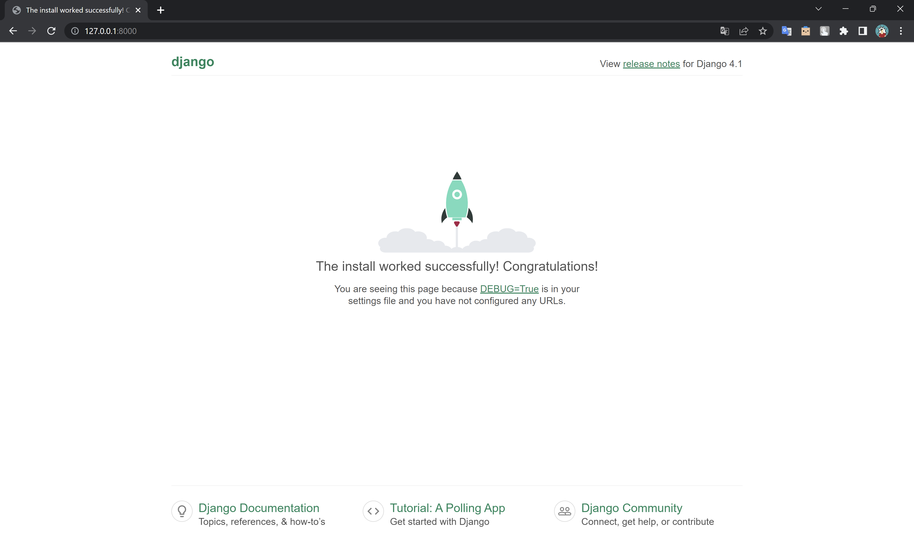

# schedule-excel-parser
Утиліта аналізу файла розкладу

## Запуск

Після встановлення docker в терміналі виконаємо команду:

`docker-compose --file docker-compose.yml up --build -d`

Після чого, програма стане доступною по адресу http://127.0.0.1:8000/ 

